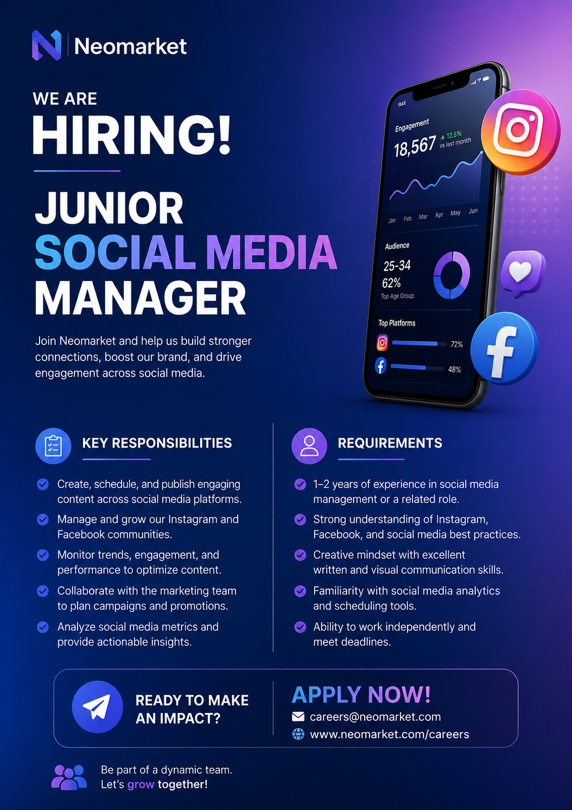

# AI for Income: Your Personal Job Assistant

## 🎯 Lesson Goal
By the end of this session, you will be able to:
- Create a professional CV using AI
- Generate a tailored cover letter
- Write a job application email
- Apply to jobs faster and smarter using AI

---

# 🧠 Part 1: Understanding AI (Very Important)

Before we start, understand this:

AI is not magic.  
AI follows **your instructions (prompts)**.

👉 If your instruction is weak → output is weak  
👉 If your instruction is clear → output is powerful  

### Example:

❌ Bad Prompt:
> Make me a CV  

✅ Good Prompt:
> Act as a professional CV writer. Ask me structured questions (education, skills, experience, projects). After collecting my answers, generate a clean, ATS-friendly CV.

---

# 🟢 Part 2: Create Your CV Using AI

## Step 1: Use This Prompt

Copy and paste this into your AI tool:

> Act as a professional CV writer. Ask me structured questions one by one about my education, skills, experience, and projects. After I answer, generate a clean, modern, ATS-friendly CV.

---

## Step 2: Answer the Questions

- Be honest
- Be clear
- Give enough detail

---

## Step 3: Generate Your CV

Once AI finishes:
- Review the CV
- Make corrections if needed

---

## Step 4: Export Your CV

Save your CV as:
- PDF (recommended)
- Word document

---

# 🔵 Part 3: Apply AI to a Real Job

Now we simulate a real job application.

 download job post **job post**.

""

---

## Step 1: Upload to AI

Upload:
- Your CV
- The job post (image or text)

---

## Step 2: Use This Prompt

> Analyze this job post and my CV. Create a tailored, professional cover letter that matches my skills with the job requirements. Keep it clear, confident, and human.

---

## Step 3: Generate Your Cover Letter

- Read it carefully
- Make small edits if needed

---

## Step 4: Export It

Save as:
- PDF or Word document

---

# 🟣 Part 4: Write a Job Application Email

Now let’s complete the process.

---

## Step 1: Use This Prompt

> Write a professional job application email using my cover letter. Keep it short, clear, and polite.

---

## Step 2: Review Your Email

Make sure:
- It sounds natural
- It is not too long
- It includes your intention clearly

---

## Step 3: Final Application

You now have:
- ✅ CV  
- ✅ Cover Letter  
- ✅ Email  

You are ready to apply.

---

# 🔁 Final Challenge

Apply this process to **3 different jobs**.

Each time:
- Adjust your prompt slightly
- Improve your results

---

# 🧠 Key Takeaway

AI will not get you a job.

But…

👉 Knowing how to use AI gives you an unfair advantage.

---

# 💡 Bonus Tip

Don’t just copy results.

Ask yourself:
- Why did this prompt work?
- How can I improve it?

That’s how you become powerful with AI.

---

🔥 You now have a skill that most people don’t.
Use it.